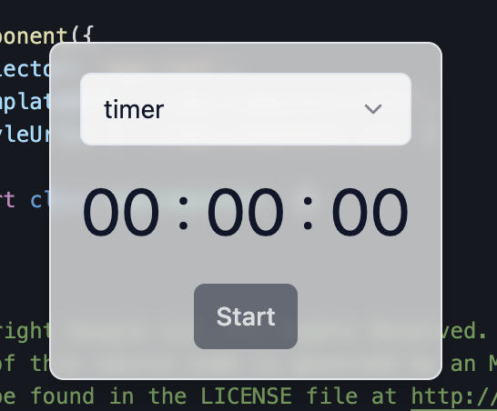

<h1 style="text-align: center; margin-bottom: 20px; font-size: 28px; border-bottom: none">Timer Chrome Extension ⏰</h1>

<div style="text-align: center">
  
</div>

<p style="text-align: center; margin-top: 20px; font-size: 18px">シンプルなタイマーの Google Chrome 拡張機能</p>

## Features

- Timer
- Stopwatch

## How to Use

前提条件: 任意のバージョンの Node.js がインストールされている

1. このリポジトリを clone する
2. pnpm をインストール `corepack enabled`
3. node_modules をインストール `pnpm i`
4. アプリをビルド `pnpm build`
5. Google Chrome の[拡張機能画面](chrome://extensions/)でデベロッパーモードを ON にする
6. 「パッケージ化されていない拡張機能を読み込む」を押下して`/dist`配下をアップロードすると拡張機能が利用できるようになる

## Developers Guide

ローカルでの開発時は下記コマンドで動作確認可能

```bash
pnpm dev
```
