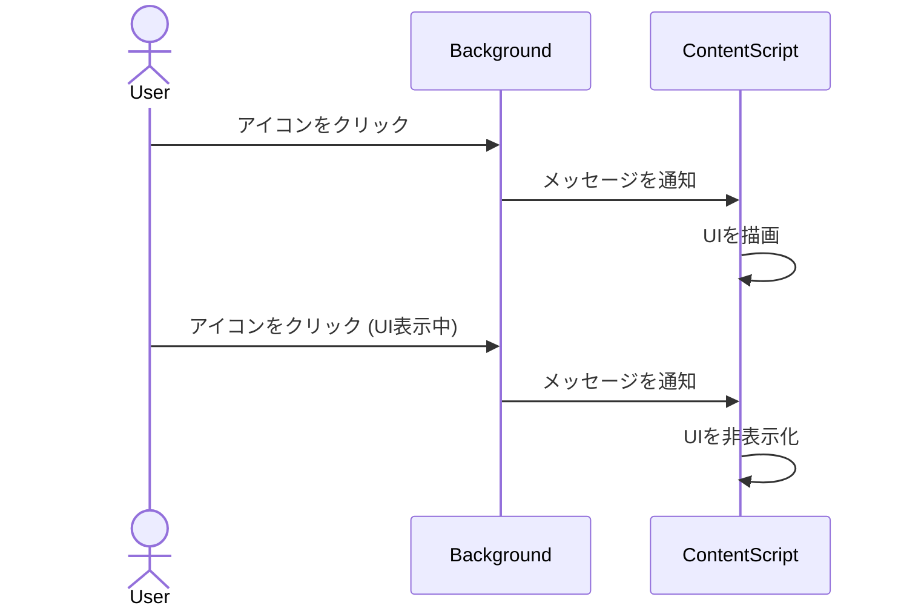

```mermaid
sequenceDiagram
    actor User
    participant Background
    participant ContentScript

    User->>Background: アイコンをクリック
    Background->>ContentScript: メッセージを通知
    ContentScript->>ContentScript: UIを描画
    User->>Background: アイコンをクリック (UI表示中)
    Background->>ContentScript: メッセージを通知
    ContentScript->>ContentScript: UIを非表示化
```